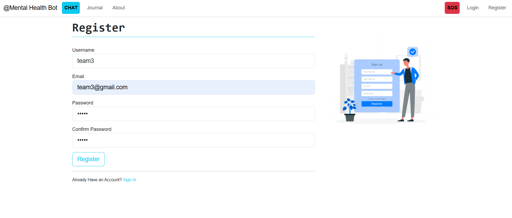
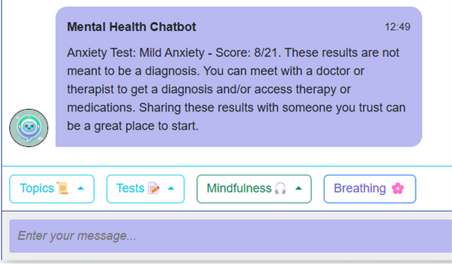

# LUMORA

Lumora is an AI-driven mental health chatbot designed to
support individuals experiencing emotional distress. It analyzes user input using NLP and offers relevant content like
mindfulness tips, motivational quotes, and relaxation activities
in real-time, fostering emotional well-being through safe and
private conversations.

## Project Structure

- `Python-Mental-Health-Chatbot-main/`: Main directory containing the chatbot implementation.
- `chatbot-model.h5`: Pre-trained model for intent classification.
- `data.pickle`: Serialized data objects used by the chatbot.

## Technologies Used

- **Python**: Core programming language.
- **TensorFlow/Keras**: For building and training the neural network model.
- **Natural Language Toolkit (NLTK)**: For text preprocessing.
- **Pickle**: For object serialization.

## Getting Started

### Prerequisites

Ensure you have the following installed:

- Python 3.x
- pip (Python package installer)

### Installation

1. **Clone the repository:**
   - git clone https://github.com/Sowmiyahub/Mental_HealthCare_ChatBot.git
   - cd Mental_HealthCare_ChatBot/Python-Mental-Health-Chatbot-main
2. **Install dependencies:**
   - pip install -r requirements.txt
   - Note: If requirements.txt is not present, install the necessary libraries manually:
     pip install tensorflow nltk
3. **Run the chatbot:**
    - python chatbot.py
      
## Features
- Intent Recognition: Classifies user inputs into predefined intents.
- Contextual Responses: Provides responses based on the identified intent.
- Extensible Design: Easily add new intents and responses by modifying the intents JSON file.
 
## Functions
- Register, Login, and Continue as a Guest (For privacy reasons)
- Chat with the chatbot
- Select a specific topic
- Conduct a mental health test (Depression and Anxiety)
- Mindfulness Exercises
- Breathing Flower
- Journalling for manual tracking
- Stress Relief Activities - Virtual Plant, Virtual Bunny, Game
- SOS Hotline (Only Malaysia)
- Edit profile

## Technical Domain
- Create using Python
- Flask for the Web
- SQLAlchemy for Database
- Bootstrap for the UI
- TensorFlow and NLTK for the machine learning model
- Other Library like Flask-login, Flask-bcrypt
  
## Screenshots

## Contributing
Contributions are welcome! Please fork the repository and submit a pull request for any enhancements or bug fixes.
## Contact
For any inquiries or feedback, please contact sowmiyadasa2004@example.com.
